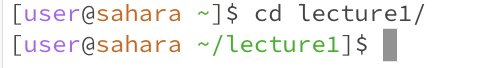

# Lab Report 1
---
## `cd`
1. `cd` no arguments
* 
* The working directory when the command was run was `/home`.
* I got the output in the image as cd is used to change the working directory, and if you write cd with no argument, it returns you to your home directory. Since I am already in my home directory, nothing changed.
* This is not an error

2. `cd` path to directory
* 
* The working directory when the command was run was `/home`
* `cd` is used to change your working directory; when I ran `cd` lecture1, it changed my working directory to lecture1 instead of my home directory; this is shown by the lecture1 text in green.
* There are no errors in this example. However, there may be an error if the specified directory doesn't exist.

3. `cd` path to file
* 
* The current working directory when the file is run is `/home`.
* I got that output as cd only works for paths to directories and is not used with a path to a file as an argument.
* There is an error, as cd only works with paths to directories and not files.

---
## `ls`
1. `ls` no arguments
* 
* The working directory when the command was run was `/home/lecture1`.
* `ls`, without any arguments, simply lists out all the contents of the working directory when the command was run, as seen in the output.
* There are no errors

2. `ls` path to directory.
* 
* The current working directory when the command was run was `/home`.
* As shown in the output, when a path to a directory is used as an argument for the `ls` command, `ls` lists the contents of the directory specified in the argument.
* There is no error in this case. There is only an error if the specified directory does not exist.

3. `ls` path to file
* 
* The current directory when the command was run was `/home`.
* As shown in the output, when a path to a file is used as an argument for the `ls` command, the path to the file will be displayed if the file exists.
* There is no error in this case, as the file exists. However, there will be an error if the file does not exist.

---
## `cat`
1. `cat` no arguments
* 
* the current working directory is `/home`.
* When used without an argument, the cat command will read from its standard input. Initially, it seems like it's not doing anything, but in actuality, it is waiting for a response from the user. Anything you then type in the terminal will be echoed back and displayed on the terminal..
* There are no errors.

2. `cat` path to directory
* 
* The current working directory is `/home`.
* The output, when giving the `cat` command a path to a directory as an argument, is a message saying that the path is a path to a directory. As the `cat` command is supposed to be used on files and not directories.
* This is an error as the `cat` command expects a file, not a directory.

3. `cat` path to file.
* 
* The current working directory is `/home`.
* The output is the contents of a specific file; in this case, it displays the contents of README.
* There is no error.
