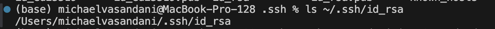
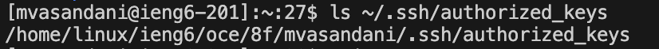
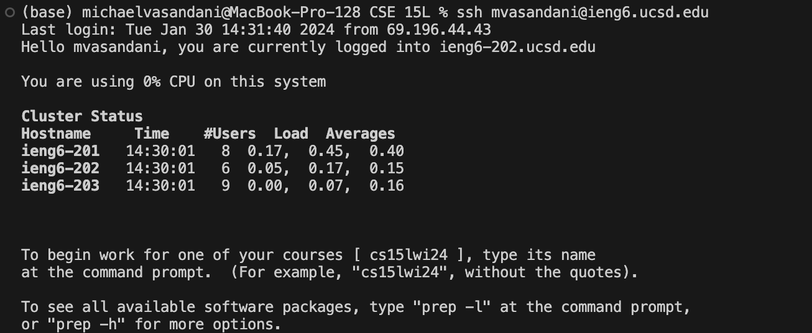

# Lab Report 2
---
## Part 1

```
import java.io.IOException;
import java.net.URI;


class Handler implements URLHandler {
    String toadd = "";
    
    public String handleRequest(URI url) {
        String userarg = "404 ";
        String stringarg = "Not Found";
        if(url.getPath().contains("/add")) {
            String[] parameters = url.getQuery().split("&");
            String[] UserPart = parameters[1].split("=");
            String[] StringPart = parameters[0].split("=");
        
            if(UserPart.length < 1 || StringPart.length < 1) {
                return "404 Not Found";
            }
            if(parameters[1].contains("user")) {
                userarg = UserPart[1];
            }
            if(parameters[0].contains("s")) {
                stringarg = StringPart[1];
            }
                
          toadd += userarg + ": " + stringarg + "\n";
          return toadd;
        
        }
        return "404 Not Found";
    }

}

class chatserver {
    public static void main(String[] args) throws IOException {
        if(args.length == 0){
            System.out.println("Missing port number! Try any number between 1024 to 49151");
            return;
        }

        int port = Integer.parseInt(args[0]);

        Server.start(port, new Handler());
    }
}
```
---
* 
#### Which methods are called
* The `handleRequest()` method is the primary method that is called.
* The `main()` method is also called
* Inside the `handelRequest` method, other methods are called such as: `getQuery()`, `split()`, `length`, and `contains()`

#### What are the relevant arguments in those methods
* Argument of the `handleRequest()` method is URI http://localhost:3250/add-message?s=Yo&user=Michael
* The argument for the `main()` method is the port number, in this case it is 3250.
* `getQuery()` is called multiple times but it doesn't take in any arguments
* `split()` is called multiple times the arguments for this method each time it's called is: "&", "=","="
* `length` method does not take in any argument.
* `contains()` methods is called multiple times the argument for this method each time it's used is: "user", "s", "/add-message"

#### How do the values of any relevant fields of the class change from this specific request? 
* toadd = "Michael: Yo \n" changed from toadd =  ""

* 
#### Which methods are called
* The `handleRequest()` method is the primary method that is called.
* The `main()` method is also called
* Inside the `handelRequest` method, other methods are called such as: `getQuery()`, `split()`, `length`, and `contains()`

##### What are the relevant arguments in those methods
* Argument of the `handleRequest()` method is URI http://localhost:3250/add-message?s=Hello&user=Not%20Michael
* The argument for the `main()` method is the port number, in this case it is 3250.
* `getQuery()` is called multiple times but it doesn't take in any arguments
* `split()` is called multiple times the arguments for this method each time it's called is: "&", "=", "="
* `length` method does not take in any argument.
* `contains()` methods is called multiple times the argument for this method each time it's used is: "user", "s", "/add-message"
#### How do the values of any relevant fields of the class change from this specific request? 
* toadd = "Michael: Yo \n Not Michael: Hello \n" changed from toadd =  "Michael: Yo \n".

# part 2
#### The absolute path to the private key
* 

#### The absolute path to the public key
* 

#### terminal interaction
* 

# part 3
#### couple sentences on what I learned
* I learned alot of things from the past two weeks of lab. First I learned about the different components of the url. I also learned how to connect to a server from my local device using ssh. I learned how to deal with urls and servers using java. 
