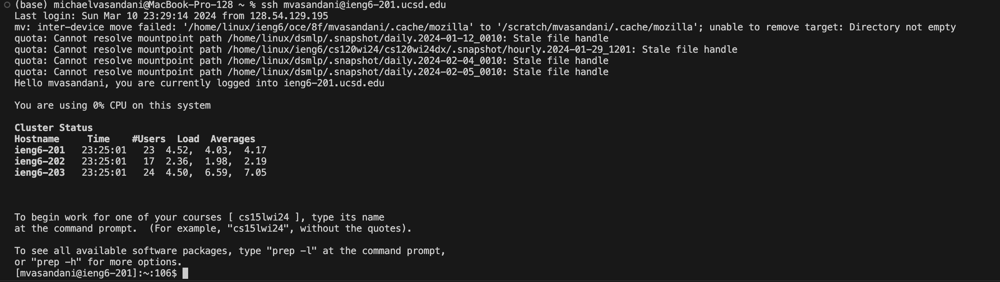

# Lab Report 4
---
## Step 4 Log into ieng6

keys pressed and explanation: `s` `s` `h` `<space>` `m` `v` `a` `s` `a` `n` `d` `a` `n` `i` `@` `i` `e` `n` `g` `6` `-` `2` `0` `1` `u` `c` `s` `d` `.` `e` `d` `u`  `<enter>` -201 - the ssh command lets me login into the specified server which in this case is `ieng6-201`

## Step 5: Clone your fork of the repository from your Github account (using the `SSH` URL)

keys pressed and explanation: `g` `i` `t` `<space>` `c` `l` `o` `n` `e` `<space>` `<CTRL-V>` `<enter>` - I had the `ssh` url copied so I just had to paste it into the terminal, the `git clone` command lets me clone my fork of the `lab7` repository on github into my virtual machine.

## Step 6: Run the tests, demonstrating that they fail

keys pressed and explanation:
* `c` `d` `l` `<tab>` `<enter>` - Used `cd` in order to change the current directory to `lab 7`
* `l` `s` `<enter>` - Used `ls` in order to see the files in this directory
* `b` `a` `s` `h` `<space>` `t` `<tab>` `<enter>` - Here, I used the `bash` command to run a bash script in order to run the test

## Step 7: Edit the code file to fix the failing test

Keys pressed and explanation:
* `v` `i` `m` `<space>` `L` `i` `<tab>` `.` `<tab>` `<enter>` - Here I used the `vim` command in order to open my desired file for editing through `vim`, I used the tab key to complete the file name
* `<up>` `<up>` `<up>` `<up>` `<up>` `<up>` `w` `w` `<left>` - to navigate to the line causing the error, I used w to move the cursor to the first character of the next word in order to speed up navigation (When I opened `vim` into ListExamples.java the cursor was at the last line 
* `i` - to go into editing mode
* `<delete>` `<2>` - to delete the error and fix it
* `<esc>` - to exit editing mode 
* `:` `w` `q` `<enter>` - To save the changes made

## Step 8: Run the tests, demonstrating that they now succeed

keys pressed and explanation:
* `<up>` `<up`> `<enter>` - I pressed the up arrow key twice as the `bash test.sh` was 2 up in the search history so I used the up arrow keys to access it

## Step 9: Commit and push the resulting change to your Github account (you can pick any commit message!)

Keys pressed and explanation:
* `g` `i` `t` `<space>` `a` `d` `d` `<space>` `.` `<enter>` - The `git add .` command stages all changes in the current directory to be included in the next `git commit`
* `g` `i` `t` `<space>` `c` `o` `m` `m` `i` `t` `<space>` `"` `C` `h` `a` `n` `g` `e` `d` `<space>` `i` `n` `d` `e` `x` `1` `<space>` `t` `o` `<space>` `i` `n` `d` `e` `x` `2` `"` `<enter>` - the `git commit` command creates a new commit containing the currently staged changes, by adding `-m` followed by quotation marks I can type of a message associated with the commit.
* `g` `i` `t` `<space>` `p` `u` `s` `h` `<enter>` - The `git push` command allows me to commit from my local repository (in this case within the server) into a remote repository. 
