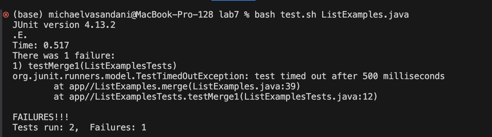
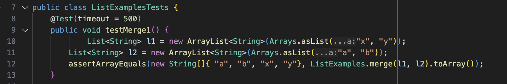
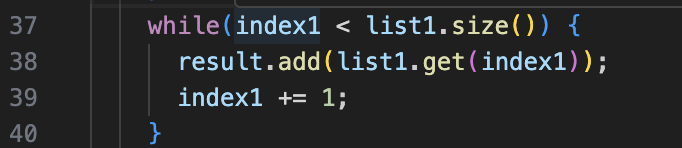
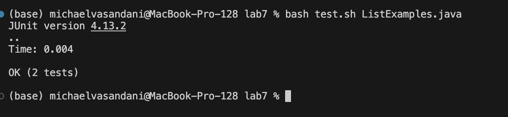
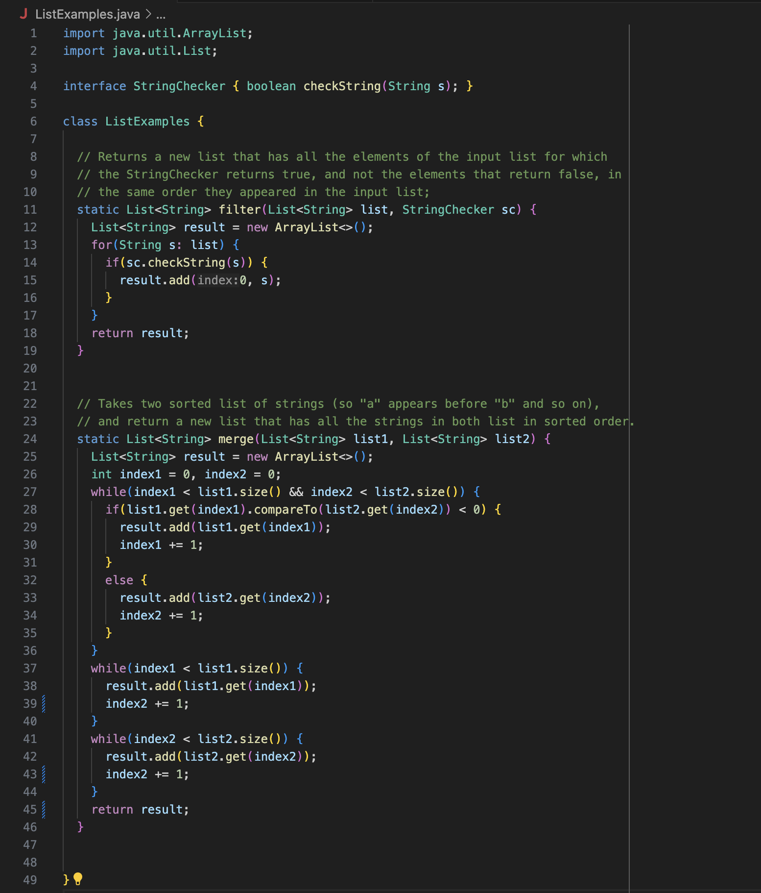

# Lab Report 4
---

**Student**: Hi I'm having a problem with my ListExamples.java file, I ran the bash test.sh file on the java file, but I keep on failing tests. I think I might have some problems inside one of my while loops, but I'm not really sure .I attached an image of the terminal output when I ran the tests and the test I think I'm failing.

**TA**: From looking at your your terminal output it looks like your test is timing out, this is usually the case when a loop is run an infinite amount of times. From the terminal output it also looks like there's a problem at line 39 of your ListExamples.java file, perhaps look at this line and see if its causing your loop to go on indefinitely.

**Student**: When looking at line 39 I realized I was incrementing index2 instead of index1 causing my while loop to run an infinite amount of times. I fixed this by incrementing index1 instead and now the problem seems to be fixed. I attached the terminal output when I now ran the test.sh bash script as well as my fixed code.

* **File and Director Structure**:
* lab7\
    -.gitignore\
    -ListExamples.java\
    -ListExamplesTests.java\
    -StringChecker.class\
    -test.sh

* **Contents of file before fixing problem**:

* **The full command line (or lines) you ran to trigger the bug**
bash test.sh ListExamples.java

* **A description of what to edit to fix the bug**
Changed line 39 of ListExamples.java from index2+= 1; to index1+= 1;

