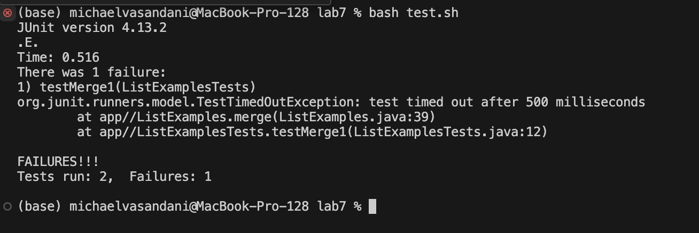
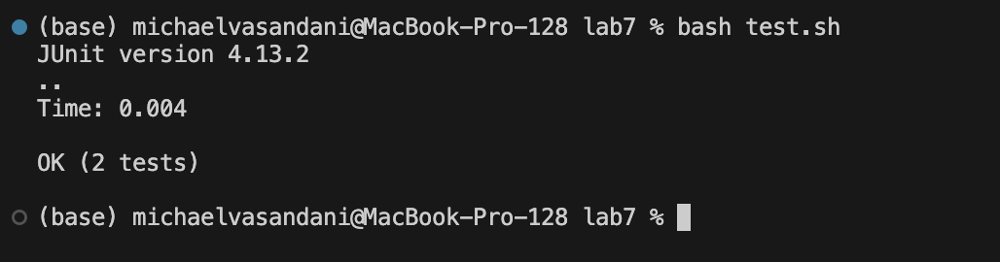
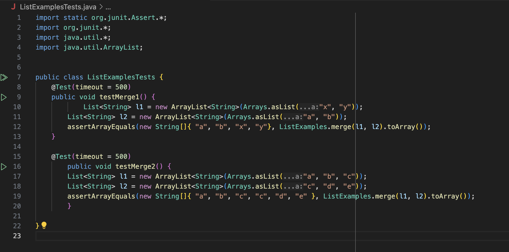

# Lab Report 4
---

**Student**: Hi I'm having a problem with my `ListExamples.java` file, I ran the `bash test.sh` command, but I keep on failing tests. I think I might have some problems inside one of my while loops, but I'm not really sure. I attached an image of the terminal output when I ran the tests and the test I think I'm failing.

**TA**: From looking at your your terminal output it looks like your test is timing out, this is usually the case when a loop is run an infinite amount of times. From the terminal output it also looks like there's a problem at line 39 of your `ListExamples.java` file. A question you could ask yourself is, what's in line 39 of `ListExamples.java` and does this line potentially cause an infinite loop?

**Student**: When looking at line 39 I realized I was incrementing `index2` instead of `index1` causing my while loop to run an infinite amount of times. I fixed this by incrementing index1 instead and now the problem seems to be fixed. I attached the terminal output when I now ran the `test.sh` bash script as well as my fixed code.

* **File and Director Structure**:

- lab7
    - lib
      - hamcrest-core-1.3.jar
      - junit-4.13.2.jar
    - .gitignore
    - ListExamples.java
    - ListExamplesTests.java
    - test.sh

* **Contents of file before fixing problem**:

* **The full command line (or lines) you ran to trigger the bug**
bash test.sh ListExamples.java

* **A description of what to edit to fix the bug**
Changed line 39 of ListExamples.java from index2+= 1; to index1+= 1; fixing the infinite loop.

