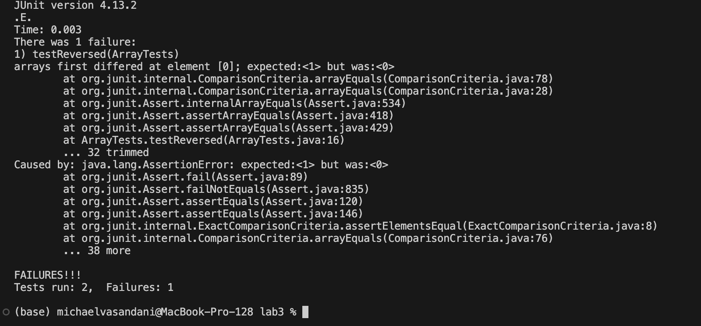

# Lab Report 3

## part 1:
### A failure-inducing input for the buggy program
```
  @Test
  public void testReversed() {
    int[] input1 = {1, 2 ,3};
    assertArrayEquals(new int[]{3, 2, 1}, ArrayExamples.reversed(input1));
  }
}
```
### An input that doesn't induce a failure
```
  @Test
  public void testReversed() {
    int[] input1 = {};
    assertArrayEquals(new int[]{}, ArrayExamples.reversed(input1));
  }
}

```

### The symptom


### The bug, as the before-and-after
#### before
```
  static int[] reversed(int[] arr) {
    int[] newArray = new int[arr.length];
    for(int i = 0; i < arr.length; i += 1) {
      arr[i] = newArray[arr.length - i - 1];
    }
    return arr;
  }
```

#### after 
```
  static int[] reversed(int[] arr) {
    int[] newArray = new int[arr.length];
    for(int i = 0; i < arr.length; i += 1) {
      newArray[i] = arr[arr.length - i - 1];
    }
    return newArray;
  }
```
* reason: the old code re-initialized the elements of the original array to the elements of the new array; this caused the original arrays to get replaced with zero, as the new array has no elements initialized yet.
* The fix: In order to fix it, I just switched around newArray and the original array so that the elements of the new array get initialized to the aspects of the old array in the desired manner.

## part 2: find command line options
### 1. -size
* example 1:
```
  (base) michaelvasandani@MacBook-Pro-128 technical % find plos/ -size +12k
plos//journal.pbio.0030032.txt
plos//pmed.0020059.txt
plos//pmed.0010039.txt
plos//journal.pbio.0020354.txt
plos//pmed.0010010.txt
plos//journal.pbio.0020140.txt
plos//journal.pbio.0020183.txt
plos//journal.pbio.0020394.txt
plos//journal.pbio.0020419.txt
plos//journal.pbio.0020169.txt
plos//journal.pbio.0020035.txt
plos//pmed.0020067.txt
plos//pmed.0020073.txt
plos//journal.pbio.0030024.txt
plos//pmed.0020249.txt
plos//journal.pbio.0020019.txt
plos//journal.pbio.0020145.txt
plos//pmed.0020103.txt
plos//journal.pbio.0020347.txt
plos//journal.pbio.0020420.txt
plos//journal.pbio.0020187.txt
plos//journal.pbio.0020150.txt
plos//journal.pbio.0020232.txt
plos//journal.pbio.0030021.txt
plos//pmed.0020060.txt
plos//journal.pbio.0020146.txt
plos//pmed.0010028.txt
plos//journal.pbio.0020350.txt
plos//journal.pbio.0020190.txt
plos//pmed.0020061.txt
plos//journal.pbio.0020068.txt
plos//journal.pbio.0020054.txt
plos//pmed.0010066.txt
plos//journal.pbio.0020121.txt
plos//journal.pbio.0030050.txt
plos//journal.pbio.0020241.txt
plos//journal.pbio.0020043.txt
plos//pmed.0020039.txt
plos//journal.pbio.0030127.txt
plos//pmed.0010058.txt
plos//pmed.0010064.txt
plos//pmed.0020206.txt
plos//pmed.0020212.txt
plos//pmed.0020216.txt
plos//journal.pbio.0030094.txt
plos//journal.pbio.0020046.txt
plos//journal.pbio.0020052.txt
plos//pmed.0020160.txt
plos//journal.pbio.0030137.txt
plos//pmed.0020161.txt
plos//journal.pbio.0020127.txt
plos//journal.pbio.0020133.txt
plos//pmed.0020015.txt
plos//journal.pbio.0020053.txt
plos//journal.pbio.0030056.txt
plos//journal.pbio.0020125.txt
plos//journal.pbio.0020440.txt
plos//pmed.0010062.txt
plos//pmed.0020162.txt
plos//pmed.0020016.txt
plos//journal.pbio.0020101.txt
plos//journal.pbio.0020302.txt
plos//pmed.0010052.txt
plos//journal.pbio.0030065.txt
plos//journal.pbio.0020276.txt
plos//pmed.0020232.txt
plos//pmed.0020018.txt
plos//journal.pbio.0020116.txt
plos//pmed.0010045.txt
plos//journal.pbio.0030062.txt
plos//pmed.0020009.txt
plos//journal.pbio.0020113.txt
plos//pmed.0020182.txt
plos//journal.pbio.0020311.txt
plos//journal.pbio.0030102.txt
plos//journal.pbio.0020310.txt
plos//pmed.0020140.txt
plos//pmed.0020034.txt
plos//journal.pbio.0020064.txt
plos//pmed.0010056.txt
plos//journal.pbio.0020306.txt
plos//journal.pbio.0020267.txt
plos//pmed.0020209.txt
plos//pmed.0020246.txt
plos//journal.pbio.0020228.txt
plos//journal.pbio.0020214.txt
plos//pmed.0020050.txt
plos//journal.pbio.0020348.txt
plos//journal.pbio.0020406.txt
plos//pmed.0020045.txt
plos//journal.pbio.0020001.txt
plos//journal.pbio.0020161.txt
plos//journal.pbio.0020439.txt
plos//journal.pbio.0020404.txt
plos//journal.pbio.0020148.txt
plos//journal.pbio.0020028.txt
plos//journal.pbio.0020206.txt
plos//journal.pbio.0020164.txt
plos//pmed.0010036.txt
plos//journal.pbio.0020400.txt
plos//journal.pbio.0020401.txt
plos//pmed.0020123.txt
plos//journal.pbio.0020213.txt
plos//pmed.0010021.txt
plos//pmed.0010008.txt
plos//pmed.0020040.txt
plos//pmed.0020068.txt
plos//journal.pbio.0020012.txt
```

* example 2:
```
(base) michaelvasandani@MacBook-Pro-128 technical % find plos/ -size -3k 
plos//pmed.0020048.txt
plos//pmed.0020074.txt
plos//pmed.0010029.txt
plos//pmed.0010067.txt
plos//pmed.0020028.txt
plos//pmed.0020027.txt
plos//pmed.0020191.txt
plos//pmed.0020226.txt
plos//pmed.0020024.txt
plos//pmed.0020192.txt
plos//pmed.0020145.txt
plos//pmed.0020021.txt
plos//pmed.0010068.txt
plos//pmed.0020022.txt
plos//pmed.0020157.txt
plos//pmed.0010025.txt
plos//pmed.0020086.txt
plos//pmed.0020085.txt
plos//pmed.0020278.txt
plos//pmed.0020082.txt
plos//pmed.0020120.txt
plos//pmed.0020281.txt
```
* Using a size, you can perform a search query to find files that are equal to, greater than or less than your specified file size. This is useful if you want to look for specific files that are too big or that are very small.

### -type
* example 1:
```
(base) michaelvasandani@MacBook-Pro-128 technical % find government -type d
government
government/About_LSC
government/Env_Prot_Agen
government/Alcohol_Problems
government/Gen_Account_Office
government/Post_Rate_Comm
government/Media
```
* Using -type d prints out the names paths of directories contained in a certain directory. This is useful if you want to perform operations on directories without affecting the files inside them.

* Example 2:
```
(base) michaelvasandani@MacBook-Pro-128 technical % find plos/ -type f
plos//pmed.0020273.txt
plos//journal.pbio.0030032.txt
plos//pmed.0020065.txt
plos//pmed.0020071.txt
plos//pmed.0020059.txt
plos//pmed.0010039.txt
plos//journal.pbio.0020354.txt
plos//pmed.0010010.txt
plos//journal.pbio.0020156.txt
plos//pmed.0020104.txt
plos//pmed.0020272.txt
plos//pmed.0020258.txt
plos//pmed.0020099.txt
plos//journal.pbio.0020140.txt
plos//journal.pbio.0020183.txt
plos//journal.pbio.0020430.txt
plos//journal.pbio.0020394.txt
plos//journal.pbio.0020431.txt
plos//journal.pbio.0020419.txt
plos//pmed.0010013.txt
plos//pmed.0020113.txt
plos//journal.pbio.0020169.txt
plos//pmed.0020098.txt
plos//journal.pbio.0020035.txt
plos//pmed.0020067.txt
plos//pmed.0020073.txt
plos//journal.pbio.0030024.txt
plos//journal.pbio.0020223.txt
plos//pmed.0020249.txt
plos//pmed.0020275.txt
plos//journal.pbio.0020019.txt
plos//pmed.0020088.txt
plos//journal.pbio.0020145.txt
plos//pmed.0020103.txt
plos//pmed.0020117.txt
plos//journal.pbio.0020353.txt
plos//journal.pbio.0020347.txt
plos//journal.pbio.0020420.txt
plos//journal.pbio.0020346.txt
plos//journal.pbio.0020187.txt
plos//pmed.0020116.txt
plos//pmed.0020102.txt
plos//journal.pbio.0020150.txt
plos//pmed.0020062.txt
plos//pmed.0020274.txt
plos//journal.pbio.0020232.txt
plos//journal.pbio.0030021.txt
plos//journal.pbio.0020224.txt
plos//pmed.0020048.txt
plos//pmed.0020060.txt
plos//pmed.0020074.txt
plos//journal.pbio.0020146.txt
plos//pmed.0020114.txt
plos//pmed.0010028.txt
plos//journal.pbio.0020350.txt
plos//journal.pbio.0020190.txt
plos//pmed.0010029.txt
plos//pmed.0020115.txt
plos//journal.pbio.0020147.txt
plos//pmed.0020075.txt
plos//pmed.0020061.txt
plos//pmed.0020210.txt
plos//pmed.0020238.txt
plos//journal.pbio.0030051.txt
plos//journal.pbio.0020068.txt
plos//journal.pbio.0020054.txt
plos//journal.pbio.0020040.txt
plos//pmed.0010066.txt
plos//journal.pbio.0030131.txt
plos//journal.pbio.0020337.txt
plos//pmed.0020198.txt
plos//pmed.0010067.txt
plos//journal.pbio.0020121.txt
plos//pmed.0020007.txt
plos//journal.pbio.0030050.txt
plos//pmed.0020239.txt
plos//journal.pbio.0020241.txt
plos//pmed.0020005.txt
plos//journal.pbio.0020043.txt
plos//pmed.0020039.txt
plos//pmed.0010071.txt
plos//journal.pbio.0030127.txt
plos//pmed.0010058.txt
plos//pmed.0010070.txt
plos//pmed.0010064.txt
plos//pmed.0020158.txt
plos//journal.pbio.0020042.txt
plos//journal.pbio.0020297.txt
plos//pmed.0020206.txt
plos//pmed.0020212.txt
plos//pmed.0020216.txt
plos//journal.pbio.0030094.txt
plos//journal.pbio.0020046.txt
plos//pmed.0020028.txt
plos//journal.pbio.0020052.txt
plos//pmed.0020148.txt
plos//pmed.0020160.txt
plos//pmed.0010048.txt
plos//pmed.0010060.txt
plos//journal.pbio.0030137.txt
plos//journal.pbio.0030136.txt
plos//pmed.0010061.txt
plos//pmed.0010049.txt
plos//pmed.0020161.txt
plos//journal.pbio.0020127.txt
plos//pmed.0020149.txt
plos//journal.pbio.0020133.txt
plos//pmed.0020015.txt
plos//journal.pbio.0020053.txt
plos//journal.pbio.0020047.txt
plos//pmed.0020203.txt
plos//journal.pbio.0030056.txt
plos//pmed.0020201.txt
plos//journal.pbio.0030097.txt
plos//pmed.0020017.txt
plos//journal.pbio.0020125.txt
plos//journal.pbio.0020440.txt
plos//pmed.0010062.txt
plos//pmed.0020189.txt
plos//pmed.0020162.txt
plos//pmed.0020016.txt
plos//pmed.0020002.txt
plos//pmed.0020200.txt
plos//pmed.0020231.txt
plos//journal.pbio.0020263.txt
plos//pmed.0020027.txt
plos//pmed.0020033.txt
plos//journal.pbio.0020101.txt
plos//pmed.0010047.txt
plos//journal.pbio.0030105.txt
plos//journal.pbio.0020302.txt
plos//pmed.0010046.txt
plos//pmed.0010052.txt
plos//pmed.0020191.txt
plos//journal.pbio.0020100.txt
plos//pmed.0020146.txt
plos//journal.pbio.0020262.txt
plos//journal.pbio.0030065.txt
plos//journal.pbio.0020276.txt
plos//pmed.0020232.txt
plos//pmed.0020226.txt
plos//pmed.0020024.txt
plos//pmed.0020018.txt
plos//pmed.0020144.txt
plos//pmed.0020150.txt
plos//journal.pbio.0020116.txt
plos//pmed.0020187.txt
plos//pmed.0010050.txt
plos//pmed.0010051.txt
plos//pmed.0020192.txt
plos//pmed.0010045.txt
plos//pmed.0020145.txt
plos//pmed.0020019.txt
plos//journal.pbio.0020063.txt
plos//journal.pbio.0030076.txt
plos//journal.pbio.0030062.txt
plos//pmed.0020237.txt
plos//journal.pbio.0020067.txt
plos//pmed.0020009.txt
plos//journal.pbio.0020073.txt
plos//pmed.0020035.txt
plos//pmed.0020021.txt
plos//journal.pbio.0020113.txt
plos//pmed.0020155.txt
plos//pmed.0010069.txt
plos//pmed.0010041.txt
plos//pmed.0020182.txt
plos//pmed.0020196.txt
plos//journal.pbio.0020311.txt
plos//journal.pbio.0030102.txt
plos//journal.pbio.0020310.txt
plos//pmed.0020197.txt
plos//pmed.0010068.txt
plos//pmed.0020140.txt
plos//journal.pbio.0020112.txt
plos//pmed.0020020.txt
plos//pmed.0020034.txt
plos//pmed.0020236.txt
plos//journal.pbio.0020272.txt
plos//pmed.0020208.txt
plos//journal.pbio.0020064.txt
plos//pmed.0020022.txt
plos//pmed.0020036.txt
plos//pmed.0010056.txt
plos//pmed.0020195.txt
plos//pmed.0010042.txt
plos//pmed.0020181.txt
plos//journal.pbio.0020306.txt
plos//journal.pbio.0030129.txt
plos//journal.pbio.0020307.txt
plos//pmed.0020180.txt
plos//pmed.0020194.txt
plos//pmed.0020157.txt
plos//journal.pbio.0020105.txt
plos//pmed.0020023.txt
plos//journal.pbio.0020071.txt
plos//pmed.0020235.txt
plos//journal.pbio.0020267.txt
plos//pmed.0020209.txt
plos//pmed.0020246.txt
plos//journal.pbio.0020228.txt
plos//journal.pbio.0020214.txt
plos//pmed.0020050.txt
plos//pmed.0020118.txt
plos//pmed.0010030.txt
plos//pmed.0010024.txt
plos//journal.pbio.0020348.txt
plos//journal.pbio.0020406.txt
plos//pmed.0010025.txt
plos//pmed.0020086.txt
plos//pmed.0020045.txt
plos//journal.pbio.0020215.txt
plos//pmed.0020247.txt
plos//pmed.0020047.txt
plos//journal.pbio.0020001.txt
plos//pmed.0020090.txt
plos//journal.pbio.0020161.txt
plos//journal.pbio.0020439.txt
plos//journal.pbio.0020404.txt
plos//pmed.0010026.txt
plos//journal.pbio.0020148.txt
plos//pmed.0020085.txt
plos//pmed.0020091.txt
plos//journal.pbio.0020028.txt
plos//journal.pbio.0020216.txt
plos//pmed.0020278.txt
plos//pmed.0020268.txt
plos//journal.pbio.0020206.txt
plos//journal.pbio.0020010.txt
plos//journal.pbio.0020164.txt
plos//pmed.0010022.txt
plos//pmed.0010036.txt
plos//journal.pbio.0020400.txt
plos//journal.pbio.0020401.txt
plos//pmed.0010023.txt
plos//pmed.0020123.txt
plos//pmed.0020094.txt
plos//journal.pbio.0020213.txt
plos//pmed.0020257.txt
plos//journal.pbio.0020013.txt
plos//pmed.0020055.txt
plos//pmed.0020082.txt
plos//pmed.0010021.txt
plos//pmed.0010034.txt
plos//pmed.0010008.txt
plos//pmed.0020120.txt
plos//journal.pbio.0020172.txt
plos//pmed.0020040.txt
plos//pmed.0020068.txt
plos//journal.pbio.0020012.txt
plos//pmed.0020281.txt
plos//pmed.0020242.txt
```
* Using -type f instructs the computer to look for regular files only. This is useful for operations that should be applied specifically to files, such as searching for files by name or extension.

### iname
```
(base) michaelvasandani@MacBook-Pro-128 technical % find government/Alcohol_Problems -iname "*session2*txt"
government/Alcohol_Problems/Session2-PDF.txt
```
* example 2:
```
(base) michaelvasandani@MacBook-Pro-128 technical % find 911report -iname "*.txt" 
911report/chapter-13.4.txt
911report/chapter-13.5.txt
911report/chapter-13.1.txt
911report/chapter-13.2.txt
911report/chapter-13.3.txt
911report/chapter-3.txt
911report/chapter-2.txt
911report/chapter-1.txt
911report/chapter-5.txt
911report/chapter-6.txt
911report/chapter-7.txt
911report/chapter-9.txt
911report/chapter-8.txt
911report/preface.txt
911report/chapter-12.txt
911report/chapter-10.txt
911report/chapter-11.txt
```
* The -iname option allows users to perform a case-insensitive search for file names; this is useful to find files, if you forgot the complete name or don't remember the capitlisation of the file.

  ### -o
* Example 1:
```
(base) michaelvasandani@MacBook-Pro-128 technical % find biomed -iname "*1468*txt" -o -iname "*2000*txt" 
biomed/1468-6708-3-10.txt
biomed/gb-2000-1-1-research002.txt
biomed/1468-6708-3-4.txt
biomed/1468-6708-3-7.txt
biomed/gb-2000-1-2-research0003.txt
biomed/1468-6708-3-3.txt
biomed/1468-6708-3-1.txt
```

* Example 2:

```
(base) michaelvasandani@MacBook-Pro-128 technical % find government/Media -iname "*Business*txt" -o -iname "*barnes*txt"
government/Media/BusinessWire2.txt
government/Media/Barnes_new_job.txt
government/Media/Barnes_pro_bono.txt
government/Media/Barnes_Volunteers.txt
government/Media/BusinessWire.txt
government/Media/Crains_New_York_Business.txt
```

* In these two examples I used the -o option acts as the operator OR, allowing users to specify multiple search criteria. This is useful for broadening search queries if you're looking for multiple things.

# Sources:
* https://snapshooter.com/learn/linux/find
* https://www.redhat.com/sysadmin/linux-find-command
